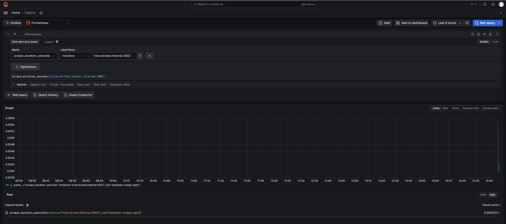

# prometheus-demo
prometheus 监控学习

## demo


## Consul 服务
### 注册
```shell
curl -X PUT -d '{"id":"127.0.0.1_3002","name":"nodejs_exporter","address":"127.0.0.1","port":3002,"tags":["nodejs"],"checks":[{"http":"http://127.0.0.1:3002","interval":"5s"}]}' http://127.0.0.1:8500/v1/agent/service/register
```

#### 注销
```shell
curl -X PUT http://127.0.0.1:8500/v1/agent/service/deregister/node_exporter_001
```

## 注意事项
只在 mac 上测试过，其他系统未测试

## TODO
- [x] 添加 consul 服务发现的部署

## 参考学习文章
- [A Deep Dive into Dockerized Monitoring and Alerting for Spring Boot with Prometheus and Grafana](https://medium.com/@edemircan/a-deep-dive-into-dockerized-monitoring-and-alerting-for-spring-boot-with-prometheus-and-grafana-144fcd209822)
- [Node.js 服务保姆级监控：带你体验 Prometheus 的魅力](https://juejin.cn/post/7231727002461683773)
