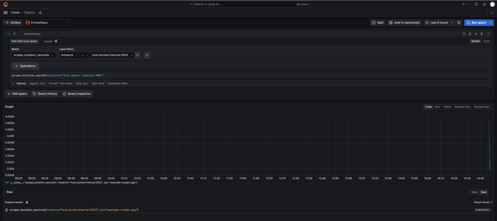

# prometheus-demo
prometheus 监控学习

## demo

## 注意事项
只在 mac 上测试过，其他系统未测试

## 参考学习文章
- [A Deep Dive into Dockerized Monitoring and Alerting for Spring Boot with Prometheus and Grafana](https://medium.com/@edemircan/a-deep-dive-into-dockerized-monitoring-and-alerting-for-spring-boot-with-prometheus-and-grafana-144fcd209822)
- [Node.js 服务保姆级监控：带你体验 Prometheus 的魅力](https://juejin.cn/post/7231727002461683773)
